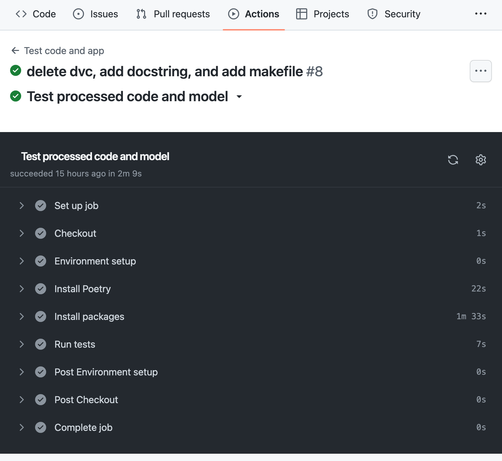

# Flaschenpost Challenge
## Quick Start
### Set up the environment
1. Install [Poetry](https://python-poetry.org/docs/#installation)
2. Set up the environment:
```bash
make setup
make activate
```
If your IDE is unable to find this virtualenv in its 'select interpreter' command. Type the following in your shell:
```bash
poetry config virtualenvs.in-project true
```
### Install new packages
To install new PyPI packages, run:
```bash
poetry add <package-name>
```

### Get data
The data is stored in a gdrive folder. 

To retrieve the data, simply type
```
dvc pull
```
to pull the data from the remote storage. That’s it!

### Run Python scripts
To run the Python scripts to process data, train model, and run a notebook, type the following:
```bash
make pipeline
```
### Create and run API
To create an API, type the following:
```bash
make api
```
We can now interact with the API by going to http://127.0.0.1:8000/docs and clicking the “Try it out” button:


You have to provide the image path. The image should live in this project. For example insert the following value:
```
{
  "img_path": "data/raw/fruits-360/Test/Apple Braeburn/3_100.jpg"
}
```
... to the Request body, which should give you "apple" as a response. This means the model correctly predicts that the image 3_100.jpg is an apple.

### View all flow runs
A [flow](https://docs.prefect.io/concepts/flows/) is the basis of all Prefect workflows.

To view your flow runs from a UI, sign in to your [Prefect Cloud](https://app.prefect.cloud/) account or spin up a Prefect Orion server on your local machine:
```bash
prefect orion start
```
Open the URL http://127.0.0.1:4200/, and you should see the Prefect UI.


### Run flows from the UI

After creating a deployment, you can run a flow from the UI with default parameters.
### Auto-generate API documentation

To auto-generate API document for your project, run:

```bash
make docs_save
```

### Run tests when creating a PR
When creating a PR, the tests in your `tests` folder will automatically run. 


